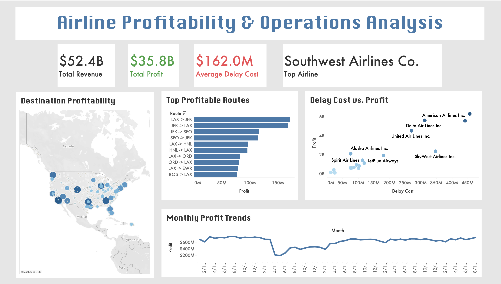
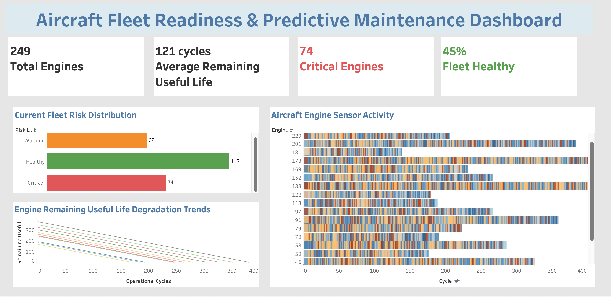
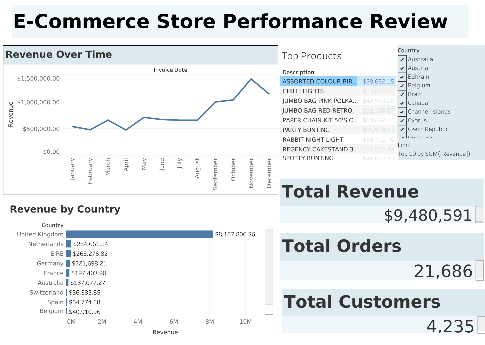
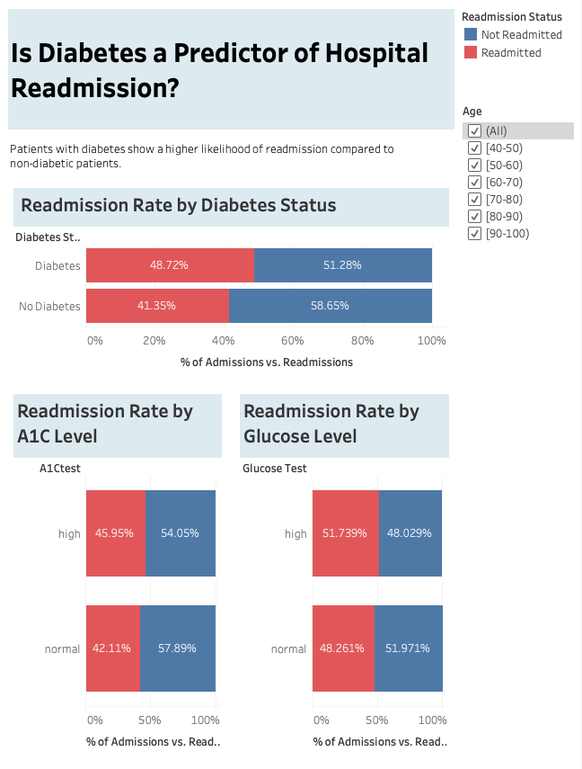
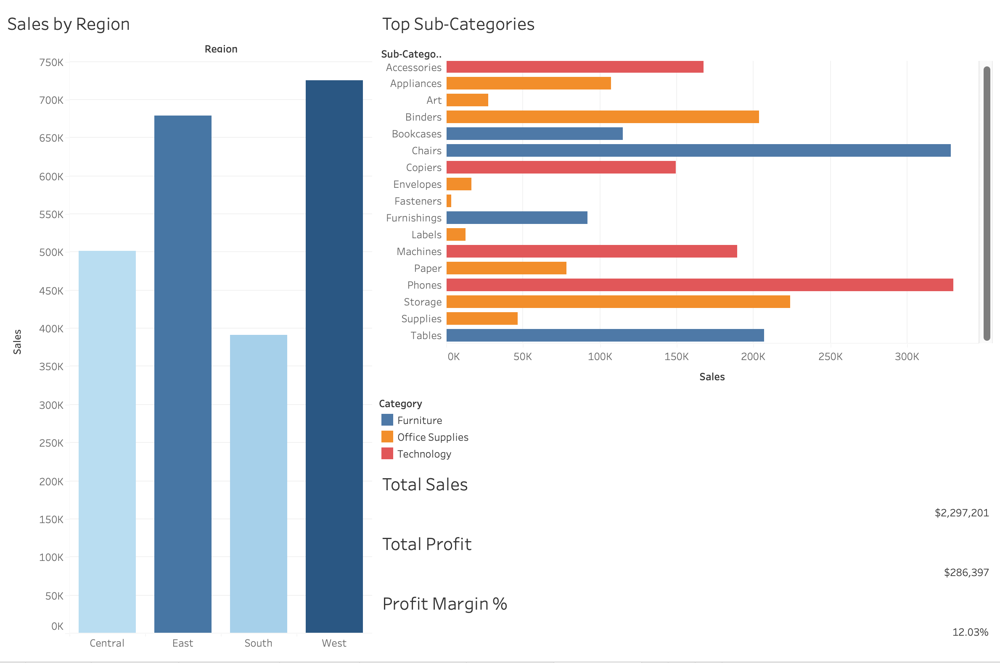
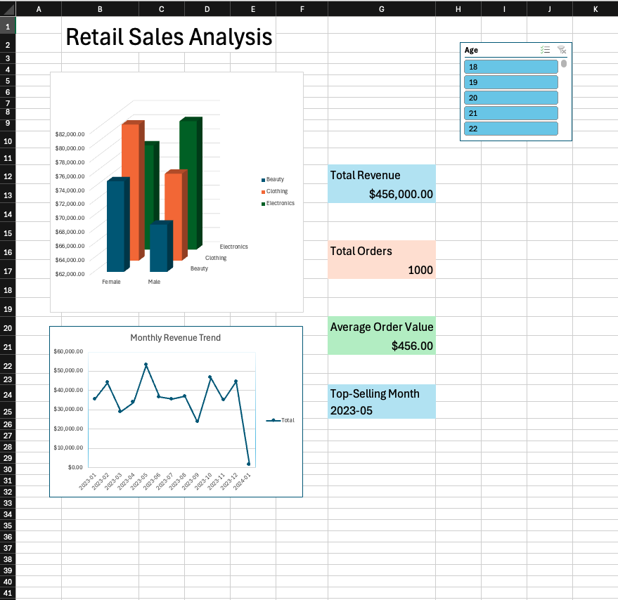

# Data Analytics Portfolio  

## About

Hi, I’m Rehma! I graduated with a B.S. in Computer Science from the University of Texas at Dallas, where I built a strong foundation in data analysis, programming, and problem-solving. I’m especially interested in analytics and product-focused roles that use data to drive decisions.

Alongside my studies, I’ve worked in fast-paced, highly regulated environments, where I developed strong attention to detail, communication skills, and the ability to handle responsibility under pressure. This experience has shaped how I approach problems: thoughtfully, efficiently, and with a focus on accuracy.

I’m always looking to keep learning and growing, and I’m currently seeking entry-level or internship opportunities where I can apply my skills and continue developing.

## Tech stack

## Table of Contents
- [Project 1: Airline Profitability & Operations Analysis](https://github.com/ruzair0815/airline_profitability_operations_analysis)
- [Project 2: Aircraft Fleet Readiness & Predictive Maintenance Dashboard](https://github.com/ruzair0815/Aircraft-Fleet-Readiness-Predictive-Maintenance/blob/main/README.md)
- [Project 3: E-Commerce Store Performance Analysis](https://public.tableau.com/app/profile/rehma.uzair/viz/E-CommerceStorePerformanceAnalysis/Dashboard1)
- [Project 4: Predicting Hospital Readmissions](https://public.tableau.com/views/IsDiabetesaPredictorofHospitalReadmission/Dashboard1?:language=en-US&:sid=&:redirect=auth&:display_count=n&:origin=viz_share_link)
- [Project 5: Movie Analysis ETL](https://github.com/ruzair0815/Movie-Analysis)
- [Project 6: Spotify Analytics](https://github.com/ruzair0815/SpotifyAnalytics)
- [Project 7: Sales Performance Analysis & Dashboard](https://github.com/ruzair0815/Sales-Performance-Analysis-Dashboard)
- [Project 8: Hotel Management Database](https://github.com/ruzair0815/HotelManagementDatabase/tree/main)
- [Project 9: Customer Sales & Revenue Analysis](https://github.com/ruzair0815/Customer-Sales-and-Revenue-Analysis)
---
## [Project 1: Airline Profitability & Operations Analysis](https://github.com/ruzair0815/airline_profitability_operations_analysis)

[Tableau Link](https://public.tableau.com/app/profile/rehma.uzair/viz/Book1_17773240510540/AirlineProfitabilityOperationsAnalysis?publish=yes)

This project analyzes 3M+ U.S. airline flight records to evaluate airline profitability, operational efficiency, and route performance. Using Python, I cleaned and transformed flight data, engineered financial metrics such as estimated revenue, fuel costs, delay penalties, and profit, and analyzed performance trends across airlines and destinations. I then built an interactive Tableau dashboard with executive KPIs, profitability trends, scatterplots, route rankings, and geographic maps to visualize operational and financial insights.

## [Project 2: Aircraft Fleet Readiness & Predictive Maintenance Dashboard](https://github.com/ruzair0815/Aircraft-Fleet-Readiness-Predictive-Maintenance/blob/main/README.md)

[Tableau Link](https://public.tableau.com/app/profile/rehma.uzair/viz/AircraftFleetReadinessPredictiveMaintenanceDashboard/Dashboard1?publish=yes)

This project analyzes aircraft engine sensor data to predict Remaining Useful Life (RUL) and support predictive maintenance. Using Python, I cleaned and analyzed sensor data, calculated RUL, and identified critical engines at risk of failure. I then built an interactive Tableau dashboard with KPIs, heatmaps, and trend visualizations to monitor fleet health and engine degradation. The project demonstrates how predictive analytics can improve maintenance planning and reduce unexpected failures.

## [Project 3: E-Commerce Store Performance Analysis](https://public.tableau.com/app/profile/rehma.uzair/viz/E-CommerceStorePerformanceAnalysis/Dashboard1)

This dashboard provides an interactive analysis of an online retail dataset, highlighting key business metrics and customer behavior from 2010–2011. It presents total revenue, order volume, and customer count alongside trends over time, allowing for quick assessment of overall performance and seasonality. Additional visualizations break down revenue by country and identify top-performing products, offering insights into geographic markets and product demand. A global country filter enables users to dynamically explore how performance varies across regions, making the dashboard a practical tool for understanding sales patterns and supporting data-driven decision-making.

## [Project 4: Predicting Hospital Readmissions](https://public.tableau.com/views/IsDiabetesaPredictorofHospitalReadmission/Dashboard1?:language=en-US&:sid=&:redirect=auth&:display_count=n&:origin=viz_share_link)

This project analyzes a decade of hospital patient data to evaluate whether diabetes is a predictor of readmission. Using Tableau, I built an interactive dashboard to compare readmission rates between diabetic and non-diabetic patients, incorporating key clinical and utilization metrics such as A1C levels and glucose test results The analysis shows that patients with diabetes experience a higher rate of readmission, suggesting that chronic condition management plays a significant role in patient outcomes. The dashboard also allows users to explore trends by age, providing a dynamic view of factors that contribute to readmission risk.

## [Project 5: Movie Analysis ETL](https://github.com/ruzair0815/Movie-Analysis)

In this project, I built an ETL pipeline to analyze movie data and uncover insights related to popularity, ratings, and profitability. The workflow extracts raw movie data from a CSV file, cleans and transforms it using Python and Pandas, and then loads the processed data into a SQLite database for structured storage and querying. The project demonstrates a full data pipeline from raw data to actionable insights using Python-based data processing and SQL for analysis.

## [Project 6: Spotify Analytics](https://github.com/ruzair0815/SpotifyAnalytics)

This project is a web application that analyzes Spotify playlists to generate insights about songs and listening trends. It processes playlist data to evaluate features like tempo, energy, and popularity, then stores both the raw and processed data for further use. The results are displayed through an interactive interface with visualizations that help users understand patterns within their music.

## [Project 7: Sales Performance Analysis & Dashboard](https://github.com/ruzair0815/Sales-Performance-Analysis-Dashboard)

In this project, I analyzed and visualized retail sales data from the Sample Superstore dataset to uncover key business insights. Using Python (Pandas, Matplotlib, and Seaborn), I calculated KPIs and explored trends across regions, product categories, and customer segments. I also built an interactive dashboard in Tableau to present the findings in a clear and user-friendly way. The analysis highlights patterns in sales and profitability, helping identify high-performing areas and opportunities for improvement.

## [Project 8: Hotel Management Database](https://github.com/ruzair0815/HotelManagementDatabase/tree/main)

This project is a hotel management database system focused on organizing and managing structured data related to hotel reservations. It stores and processes key datasets such as customer information, employee records, and booking details, enabling efficient querying and retrieval of reservation data. The system tracks important data points like check-in/check-out dates and billing information, allowing for accurate reporting and analysis of hotel operations. Built using a relational database with a web interface, the project highlights strong experience in data modeling, database design, and working with structured data to support real-world business processes.

## [Project 9: Customer Sales & Revenue Analysis](https://github.com/ruzair0815/Customer-Sales-and-Revenue-Analysis)

This project explores retail transaction data to uncover insights into customer purchasing behavior, revenue trends, and product performance across different categories and demographics. Using Excel for dashboarding and Python for data analysis, the project examines key patterns such as monthly revenue fluctuations and how spending varies across customer segments. An interactive dashboard was developed to visualize KPIs and trends, helping translate raw sales data into clear, actionable business insights.

## Contact Information

If you have any questions, feedback, or want to connect, please feel free to reach out to me. You can contact me via email at [rehmauzair@gmail.com](mailto:rehmauzair@gmail.com) or connect with me on LinkedIn at [Rehma Uzair](https://www.linkedin.com/in/rehma-uzair/).

Thank you for visiting my Data Analysis Portfolio! I hope you find my projects informative and insightful.

  
